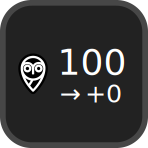

# Nightscout Stream Deck Plugin

A Nightscout plugin for the Elgato Stream Deck.

  

## Features

- Displays current blood sugar reading, change since last reading, and an arrow
- Supports mg/dL and mmol/L
- Supports Nightscout API tokens
- Only requests new data when a new reading should be available, which gives timely data while also conserving battery life

## Installation

### Manual Installation

- Download the latest plugin release [here](https://github.com/gabe565/streamdeck-nightscout/releases/latest)
- Open downloaded `.sdplugin` file. It will be automatically installed to your Stream Deck application.
